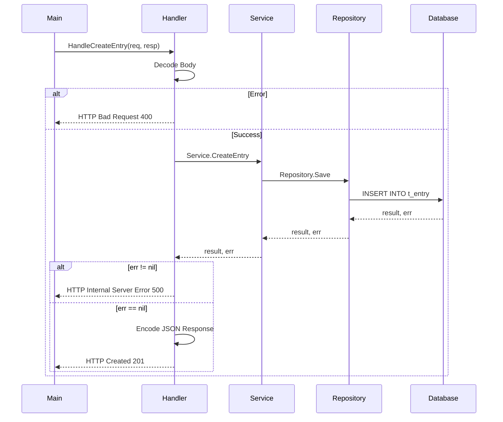

# App Controle de Peso

- [Overview](#overview)
- [Executando](#executando)
    - [Base de Dados](#base-de-dados)
    - [Rodando Aplicação](#aplicação)
- [API](#api)
    - [Entradas](#entradas)
        - [Criação](#criação)

## Overview
Projeto simples para treinar e implementar simples conceitos da linguagem GO. Uma simples API para controle de peso utilizando como base de dados um banco relacional (PostgreSQL).
O conteúdo do projeto será incrementado conforme os estudos de novos conceitos.

## Executando

### Base de Dados
Para iniciar o container do banco de dados executar o seguinte comando no terminal
```sh
docker-compose up -d
```

### Aplicação
Para iniciar a API executar o comando na raiz do projeto
```sh
go run cmd/main.go
```

## API

### Entradas
Lançamentos de peso

|Campo    |Tipo     |Descrição                    |
|---------|---------|-----------------------------|
|id       |int      |Id único de cada entrada     |
|user_id  |int      |Id do usuário relacionado    |
|weight   |float64  |Peso registrado              |
|date     |string   |Data do Registro             |


#### Criação
Fluxo da criação de um novo lançamento de peso


Exemplo de Request
```curlrc
curl -X POST \
  'localhost:8000/entries' \
  --header 'Content-Type: application/json' \
  --data-raw '{
	"user_id": 1,
	"weight": 115.5,
	"date": "2022-05-10 00:30:00"
}'
```